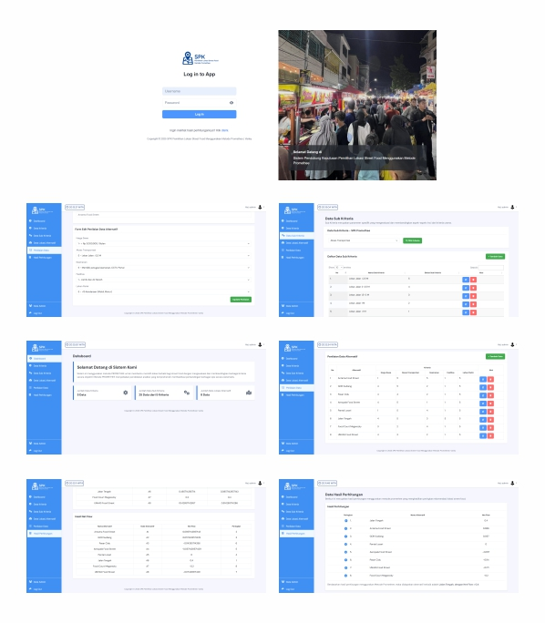

# Sistem Pendukung Keputusan Pemilihan Lokasi Streetfood

Sistem ini adalah aplikasi berbasis web yang menggunakan metode **PROMETHEE** untuk mendukung keputusan dalam pemilihan lokasi streetfood di Kota Makassar. Aplikasi ini memungkinkan admin untuk mengelola data kriteria dan alternatif, serta melakukan perhitungan otomatis berdasarkan algoritma **PROMETHEE**, di mana nilai **Net Flow** tertinggi akan menjadi alternatif terbaik.

## Fitur Utama
- **Manajemen Data Kriteria**: Admin dapat menambahkan, mengedit, dan menghapus kriteria yang digunakan dalam evaluasi lokasi.
- **Manajemen Data Alternatif**: Admin dapat menambahkan, mengedit, dan menghapus alternatif lokasi streetfood.
- **Perhitungan Otomatis**: Sistem akan menghitung peringkat berdasarkan metode **PROMETHEE**.
- **Tampilan Responsif**: Menggunakan **CSS Bootstrap** untuk tampilan yang lebih menarik dan responsif.

## Teknologi yang Digunakan
- **Frontend**: HTML, CSS (Bootstrap)
- **Backend**: PHP
- **Database**: MySQL

## Lisensi
Aplikasi ini dibuat oleh Rivanky Valensius Bara*.

